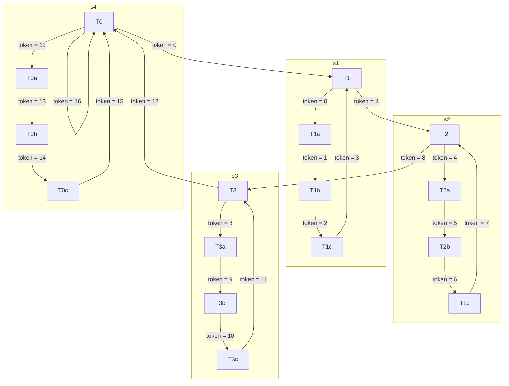

## OpenMP Token Ring

This code implements a token ring based on the following communication.
Four main tasks creates 3 additional subtasks and each one iterates a
communication token.

```mermaid
graph TD;
    T0 --"token = 0"--> T1
    T1 --"token = 4"--> T2
    T2 --"token = 8"--> T3
    T3 --"token = 12"--> T0

    T1 --"token = 0"--> T1a
    subgraph s1
        T1a --"token = 1"--> T1b
        T1b --"token = 2"--> T1c
        T1c --"token = 3"--> T1
    end

    T2 --"token = 4"-->T2a
    subgraph s2
        T2a --"token = 5"-->T2b
        T2b --"token = 6"-->T2c
        T2c --"token = 7"-->T2
    end

    T3 --"token = 8"-->T3a
    subgraph s3
        T3a --"token = 9"-->T3b
        T3b --"token = 10"-->T3c
        T3c --"token = 11"-->T3
    end

    T0 --"token = 12"-->T0a
    subgraph s4
        T0a --"token = 13"-->T0b
        T0b --"token = 14"-->T0c
        T0c --"token = 15"-->T0
    end

    T0 --"token = 16"--> T0
```
